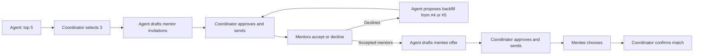

# New Ground Match Agent — Antigravity Prompt Pack (v4, Google Cloud)

**GCP project:** `new-ground-mentor-matching` (project number `672069369633`)
**Sources:** Track 1 requirements, the Mentor and Mentee Intake Questionnaires (Hackathon working document), the [New Ground program page](https://www.project127.org/newground.html), coordinator feedback, and the [Agent Build Document](https://docs.google.com/document/d/1v-1gSQZnPgMkvoBhncQTI5o7O_acIiW8cdMoV6OhHpU/edit).

> [!NOTE]
> **What changed in v4 (coordinator feedback):** the 3 mentors the coordinator selects now **review the mentee's profile and accept or decline first**. Only mentors who accepted are then offered to the mentee. That way the mentee never picks someone who then turns them down. v4 also adds backfill from the #4/#5 candidates when a mentor declines, and mentee consent (Mentee Intake Section 6) before their profile is shared with mentors.

## The workflow at a glance



## How to use this

1. In Antigravity, sign in with `gcloud auth login` and `gcloud auth application-default login` on project `new-ground-mentor-matching`.
2. Paste **Prompt 0** as a workspace rule, then run Prompts 1 → 11 in order (Prompt 11, the Project 1.27 brand theme, can also be run any time to re-skin). Check each result before you start the next one.
3. Do the **manual console checklist** (at the end of this file) before Prompt 9.

---

# Part A — Build Prompts

## Prompt 0 — Project context and rules (paste first / save as a workspace rule)

```text
You are helping build "New Ground Match Agent" for the Gloo AI Hackathon, Track 1: Agents of Flourishing.

THE USER AND THE BURDEN
- Named user: the New Ground Program Coordinator at Project 1.27 (Aurora, Colorado), who matches volunteer mentors with young adults ages 18-24 transitioning out of foster care. Today this is done by hand from Mentor and Mentee Intake Questionnaires.

END-TO-END WORKFLOW (the agent prepares; humans decide)
1. Coordinator enters/imports a mentee intake.
2. AGENT: safety screen -> data check/normalize -> hard filters -> score/rank -> reason -> verify -> save a proposal of the TOP 5 mentors (or escalate).
3. COORDINATOR: selects exactly 3 of the 5 to invite (fewer only with a written reason).
4. AGENT: drafts a "possible match" invitation email for each of the 3 mentors. Each contains the mentee profile built ONLY from mentee-consented fields, plus a single-use, expiring Accept/Decline link. The verifier checks each invitation for leakage.
5. COORDINATOR: reviews/edits and clicks "Approve & Send Mentor Invitations". This is the ONLY path that sends them. Invited mentors are placed on hold.
6. MENTORS: open their link, review the mentee profile, and Accept or Decline (with an optional private reason). Decline reasons are never shown to the mentee.
7. AGENT (follow-up): tracks responses. For each decline or expired invitation, it releases the hold and proposes a backfill from the remaining #4/#5 candidates (or a re-run if none remain). The coordinator approves any backfill invitation. Reminders to non-responding mentors are drafted for coordinator approval.
8. COORDINATOR: when all invitations are resolved (or earlier, once at least min_accepted_to_offer mentors have accepted), clicks "Prepare Mentee Offer".
9. AGENT: drafts the mentee offer email containing ONLY mentors who accepted (consented mentor fields + bio) and a single-use link. The verifier checks it.
10. COORDINATOR: clicks "Approve & Send to Mentee". This is the ONLY path that sends it.
11. MENTEE: chooses one mentor, or "None of these feel right" with an optional reason. Every option they see has already said yes, so they never face rejection.
12. COORDINATOR: confirms the match -> status "matched". The agent drafts (a) a confirmation to the chosen mentor and (b) a gracious "not selected this time" note to the other accepted mentors. The coordinator approves sending both. All holds are released.
13. FOLLOW-UP AGENT (daily, Cloud Scheduler): reminders, expirations, hold releases, backfills, and none-fit re-runs. It drafts only and never sends.

CORE PRINCIPLE: MENTEE PREFERENCES COME FIRST
- Mentee must-have preferences are HARD FILTERS; other mentee preferences carry the highest weight.
- Mentor-side preferences about a mentee are low-weight tie-breakers (mentor gender preference is a hard filter only if config says so).
- Protective gates: comfort gate (mentee selected an area and mentor rated it 1-2 of 5 -> exclude; 3 -> concern; 4-5 -> bonus) and spiritual gate (mentor "Essential" + mentee "Prefer a non-spiritual focus" -> exclude).
- Mentor acceptance protects the mentee from rejection. The mentee only ever sees mentors who said yes.

NON-NEGOTIABLE GUARDRAILS
- Synthetic data only, labeled synthetic.
- The agent prepares, ranks, explains, drafts, and routes. It cannot send anything, cannot invite, cannot create offers, cannot change statuses to invited/offer_sent/matched. Only coordinator UI actions (logged with IAP identity) do that.
- No counseling, diagnosis, or pastoral judgment.
- Never infer sensitive attributes. Mentee contact PII (name, DOB, email, phone, street address) is never sent to Gemini and never shown to mentors.
- Mentor invitations show ONLY mentee-consented fields. The mentee's sensitive self-disclosures (LGBTQ+, substance recovery, immigration, parenting, legal history, developmental) appear only if the mentee explicitly consented to share them with potential mentors. Mentee first name only.
- Mentee offers show ONLY accepted mentors and only mentor-consented fields (mentor intake Section 7). Never comfort ratings, mentor preferences, background-check status, last names, decline information, or how many mentors declined.
- Escalate (needs_human_review + reason) when: fewer than 3 mentors pass the hard filters; confidence is below threshold; data is missing/contradictory; crisis indicators appear; a must-have is unmet; the verifier fails twice; or fewer than min_accepted_to_offer mentors accept after backfills are exhausted.
- Every agent step is logged to BigQuery (agent_steps) for audit.

GOOGLE CLOUD STACK (project new-ground-mentor-matching, number 672069369633)
- Agent: Google Agent Development Kit (ADK, Python) with Gemini on Vertex AI (google-genai SDK, vertexai=True, Application Default Credentials). Model IDs are config values: a Flash-class model for orchestrator, normalizer, writers, and follow-up; a Pro-class model for the verifier. Confirm current GA model IDs in Vertex AI Model Garden.
- Data: BigQuery dataset "new_ground" (location US). BigQuery GIS for distance; zip centroids from the BigQuery public dataset geo_us_boundaries (verify names first).
- Hosting (us-central1):
  * coordinator-app (Cloud Run, FastAPI + UI + agents), protected by IAP.
  * response-portal (Cloud Run, public): serves single-use signed links for mentors (/m/{token}: accept/decline) and mentees (/o/{token}: choose). Its least-privilege service account reads only two public views and writes only two response tables.
- Coordinator access (IAP allow-list, exactly): mgomez@project127.org, adudrey@project127.org, akuykendall@project127.org (/config/access.yaml). The project has NO organization: the OAuth consent screen is External in Testing status, with these 3 as test users, and IAP uses a custom OAuth client.
- Messaging: email via the Gmail API (scope gmail.send only), sent from mgomez@project127.org; the refresh token is in Secret Manager (gmail-sender-oauth). DEMO MODE ON BY DEFAULT: every email (mentor invitations, reminders, mentee offers, confirmations, not-selected notes) is redirected to mgomez@project127.org. The subject is prefixed "[DEMO → intended: {first name}, {mentor|mentee}]" plus a banner in the body. A hard allow-list (allowed_recipients=[mgomez@project127.org]) blocks anything else. If Gmail auth is missing or expired, fall back to a simulated outbox with a visible banner.
- Secrets: Secret Manager. Scheduling: Cloud Scheduler -> Cloud Run job. Deploy: Cloud Build -> Artifact Registry -> Cloud Run. Observability: Cloud Logging + BigQuery; optional Looker Studio.

ENGINEERING RULES
- Deterministic logic (filters, distance, scoring, state transitions) lives in Python/SQL. Gemini orchestrates, normalizes free text, reasons over trade-offs, writes explanations and emails, and self-checks. Gemini never invents scores or changes state.
- Unit tests use BigQuery fakes; integration tests use dataset new_ground_dev.
- Maintain DECISIONS.md, PROMPTS.md (every prompt version + why it changed), FAILURES.md, COSTS.md. These feed the Agent Build Document.
- Never hardcode secrets; never log tokens, signed URLs, or email addresses of mentees/mentors.

BRAND (match project127.org; full spec in Prompt 11)
- All UI (coordinator app, response portal) and all HTML emails use /ui/theme.css tokens: white backgrounds, near-black text #2a2a2a, Project 1.27 red #ec1847 for primary actions, slate #333745 for secondary actions and headers, blue #00aeef as an accent only, green #82c341 for accepted/matched, light blue #e1eff5 for panels.
- Montserrat for headings and uppercase letter-spaced labels; Open Sans for body text. Square corners. Warm, hopeful, plain-language tone.
- Accessibility beats brand: WCAG AA contrast everywhere (never white text on #00aeef; never #00aeef text on white).
```

---

## Prompt 1 — Scaffold, GCP setup, and BigQuery schema

```text
Scaffold: /app (coordinator FastAPI), /portal (response portal), /agent (ADK agents, tools, prompts), /bq (schema, views, seed), /jobs (follow-up job), /ui, /evals, /docs, /config, /infra, plus README.md, DECISIONS.md, PROMPTS.md, FAILURES.md, COSTS.md, LICENSE (MIT), .env.example (non-secret settings only).

/infra/setup.sh (idempotent, prints each step; comment any command you are unsure of):
- Set project new-ground-mentor-matching; enable Cloud Run, BigQuery, Vertex AI, Secret Manager, Cloud Scheduler, IAP, Cloud Build, Artifact Registry, IAM, and Gmail APIs.
- Service accounts: sa-coordinator-app (BigQuery Data Editor on new_ground, BigQuery Job User, Vertex AI User, Secret Manager Secret Accessor); sa-response-portal (BigQuery Job User; read on v_mentor_invite_public and v_offer_public; write on mentor_responses and offer_responses only).
- BigQuery datasets new_ground and new_ground_dev (US, label data=synthetic). Secrets: link-signing-key, gmail-sender-oauth (empty).
- IAP-secured Web App User on coordinator-app for the 3 users in /config/access.yaml.
- Pause and print /infra/MANUAL_STEPS.md (External consent screen in Testing, test users, gmail.send scope, Web client for IAP, Desktop client for Gmail). If direct IAP on Cloud Run is refused for a no-organization project, fall back to an external HTTPS load balancer + serverless NEG with IAP, and record which path worked in DECISIONS.md.
- /infra/authorize_gmail.py: one-time OAuth flow run by mgomez@project127.org (gmail.send only) that stores the refresh token in Secret Manager. The README warns that tokens for an External app in Testing expire after about 7 days, so re-authorize the day before the demo.

BigQuery tables (/bq/schema.sql):

mentors (mirrors the Mentor Intake Questionnaire, Sections 1-7): mentor_id, synthetic, first_name, last_initial, gender, gender_other_text, race_ethnicity_text, age_group, skills_experience_text, skills_tags, faith_background_text, spiritual_conversation_importance, pref_mentee_gender, pref_mentee_race_ethnicity, pref_mentee_faith_interest, city, zip, geo GEOGRAPHY, max_travel_bucket, open_to_virtual, pref_mentee_has_transport, comfort_lgbtq, comfort_substance, comfort_immigration, comfort_parenting, comfort_legal, comfort_developmental (1-5), schedule_raw, schedule_blocks, meeting_frequency, personality_text, hobbies_text, career_text, activities_text, interest_tags, support_personal_growth, support_career_education, support_spiritual_growth, support_financial_life_skills, support_emotional_wellbeing, support_relationships_family, support_health_wellness (1-5), profile_share_consent (all/selected/none), profile_share_fields ARRAY<STRING>, mentee_facing_bio, consent_name, consent_date, consent_withdrawn_at, max_mentees, current_mentee_count, status, background_check_cleared, training_completed, notes, updated_at

mentor_contact (restricted; never sent to Gemini): mentor_id, full_name, email, phone

mentee_contact (restricted; never sent to Gemini or shown to mentors): mentee_id, full_name, date_of_birth, email, phone, street_address

mentees (mirrors the Mentee Intake Questionnaire): mentee_id, synthetic, first_name, last_initial, age, gender_identity_text, city, zip, geo, identifies_lgbtq, substance_recovery, immigration_refugee, is_parenting, legal_history, developmental (optional bools), mentor_preferences_text, goals_text, spiritual_alignment, transportation, communication_pref, meeting_frequency, schedule_raw, schedule_blocks, need_* (7 areas, 1-5), support_notes JSON, open_to_virtual, hobbies_text, career_interests_text, activities_text (nullable),
  -- Mentee Intake Section 6 "Profile Sharing Consent":
  mentor_share_consent (all/selected/none/not_asked), mentor_share_fields ARRAY<STRING> (first_name, gender, age, city, goals, spiritual_alignment, transportation, communication_pref, schedule_frequency, support_needs), share_identifications BOOL (separate opt-in; default false, and NOT included by "all"), mentee_intro_text (optional, in the mentee's own words), mentee_consent_name, mentee_consent_date, mentee_consent_withdrawn_at,
  notes_text, status (intake/proposed/needs_review/mentor_review/ready_to_offer/offer_sent/mentee_selected/matched/declined_all/expired), updated_at
  -- Consent rules: "all" = every field in the list (identifications only if share_identifications=true); "selected" = only checked fields; "none" = the coordinator writes a short general summary of goals (no personal details), and the verifier checks it; "not_asked" (legacy records/imports without Section 6) = safe defaults only (first name, age, general area, goals summary, top support needs, schedule/frequency) plus a "consent not collected" badge. Last name, DOB, contact info, and street address are never shared. Withdrawn consent blocks new invitations.

mentee_preferences: pref_id, mentee_id, attribute, operator, value, strength (must_have/strong/nice_to_have), source, confirmed_by_coordinator

match_proposals: proposal_id, mentee_id, created_at, status (pending_review/needs_human_review/superseded), escalation_reason, ranked_matches JSON (top 5 with sub-scores, prefs_met, explanation, concerns, virtual_first, consent_ok), excluded JSON, agent_session_id, prompt_versions JSON

selections: selection_id, proposal_id, mentee_id, mentor_ids ARRAY<STRING> (3), override_reason, selected_by, selected_at

mentor_invitations: invitation_id, selection_id, mentee_id, mentor_id, rank_in_proposal, is_backfill BOOL, message_draft, message_final, verifier_passed, approved_by, approved_at, sent_at, gmail_message_id, token_hash, expires_at, reminder_count, status (draft/sent/accepted/declined/expired/cancelled)

mentor_responses (written only by the portal; single use): invitation_id, response (accept/decline), decline_reason_private, responded_at

offers (to mentee): offer_id, mentee_id, selection_id, mentor_ids ARRAY<STRING> (accepted only), message_draft, message_final, verifier_passed, approved_by, approved_at, sent_at, gmail_message_id, token_hash, expires_at, reminder_count, status (draft/sent/responded/expired/cancelled)

offer_responses (portal only; single use): offer_id, response (chose_mentor/none_fit), chosen_mentor_id, none_fit_reason, responded_at

mentor_holds: mentor_id, invitation_id, created_at, released_at, release_reason (declined/expired/not_selected/matched/cancelled)

matches: match_id, mentee_id, mentor_id, offer_id, confirmed_by, confirmed_at

agent_sessions, agent_steps: session_id, step_no, ts, agent_name (orchestrator/verifier/normalizer/invite_writer/offer_writer/follow_up), step_type, tool_name, input JSON, output JSON, model_id, prompt_version, tokens_in, tokens_out, latency_ms, bq_bytes_processed, error

coordinator_actions: action_id, ts, actor (IAP email), action (select_3/approve_send_invites/approve_backfill/approve_reminder/prepare_offer/approve_send_offer/confirm_match/approve_closure_notes/reject/rerun/override), entity_id, details JSON

outbox: message_id, kind (mentor_invite/mentor_reminder/mentee_offer/mentee_reminder/mentor_confirmation/mentor_not_selected), intended_role, intended_first_name, delivered_to, subject, body, approved_by, sent_at, delivery_mode, gmail_message_id

Views:
- v_mentor_invite_public: invitation_id, token_hash, expires_at, status, mentee card built ONLY from mentee_share_fields (or the safe defaults if not_asked), plus distance band, overlapping availability, and the mentee's top support needs. No PII, no sensitive identification unless consented.
- v_offer_public: offer_id, token_hash, expires_at, status, and cards for ACCEPTED mentors only, built from profile_share_fields + mentee_facing_bio + distance band + overlapping availability + shared support strengths.

/config/matching.yaml: weights; comfort threshold (exclude <= 2); 20_plus = 25 mi; meet-halfway allowance; confidence threshold; top_k=5; invite_count=3; min_accepted_to_offer=2; mentor_response_days=3; mentor_reminder_after_days=2; mentee_offer_expiry_days=7; mentee_reminder_after_days=3; max_reminders=2; mentor_gender_pref_is_hard_filter=false; model IDs.
/config/messaging.yaml: delivery_mode=gmail (fallback simulated), demo_mode=true, demo_redirect_to=mgomez@project127.org, allowed_recipients=[mgomez@project127.org], sender_account=mgomez@project127.org.
/config/access.yaml: coordinators = [mgomez@project127.org, adudrey@project127.org, akuykendall@project127.org].

Add /health and confirm the app runs locally against new_ground_dev.
```

---

## Prompt 2 — Synthetic data and demo edge cases

```text
1. Write /docs/intake_mapping.md (mentor question <-> mentee question <-> matching rule; see Agent Build Document Section 2c). The mentee "Mentor Preferences" free text is normalized to mentee_preferences, and the coordinator confirms strengths (default strong, never default must_have).

2. /bq/seed.py: clearly labeled SYNTHETIC data loaded to new_ground_dev (or --dataset new_ground):
   - 40 mentors, 15 mentees across Colorado cities (Aurora, Denver, Lakewood, Littleton, Centennial, Parker, Thornton, Westminster, Boulder, Colorado Springs, Grand Junction, Delta, Montrose), zip centroids for geo, fake street addresses.
   - Varied free text; spread of 1-5 comfort/support ratings; travel buckets; virtual; spiritual importance; mostly "No preference" mentor preferences.
   - Mentor Section 7 consent: mostly "all", some "selected", 2-3 "none"; bios for consenting mentors.
   - Mentee Section 6 consent: mostly "all", some "selected", 1-2 "none", 1 "not_asked" (legacy import); a few with share_identifications=true; short intros for some.
   - Mentors at capacity, paused, and not cleared. Contact data: example.com emails and 555 numbers only.
   - Pre-seeded "mentor personas" for the demo: give each mentor a scripted tendency (accepts / declines with reason / never responds) for eval automation only. Never shown in the UI or to the agent.

3. Named DEMO mentees:
   - Demo-Happy: top 5 -> coordinator picks 3 -> 3 invitations arrive at mgomez@project127.org -> all 3 accept -> mentee offer with 3 -> mentee chooses -> matched -> confirmation + 2 not-selected notes.
   - Demo-MentorDecline: 1 of 3 declines ("schedule changed") -> agent proposes backfill with #4 -> coordinator approves -> #4 accepts -> mentee offer with 3. The mentee never learns of the decline.
   - Demo-NoResponse: 1 mentor doesn't respond -> reminder drafted at day 2 -> expires at day 3 -> backfill proposed. Use a simulated clock for the demo.
   - Demo-TwoAccept: only 2 accept and backfills are exhausted -> coordinator may send an offer with 2 (meets min_accepted_to_offer=2) or re-run.
   - Demo-AllDecline: all decline and backfills are exhausted -> escalate; agent re-runs with declined mentors excluded and summarizes decline reasons for the coordinator only.
   - Demo-ConsentNotAsked: legacy mentee with consent = not_asked -> invitations use safe defaults only; sensitive identifications withheld; "consent not collected" badge.
   - Demo-ConsentSelected: mentee shares only first name, age, goals, and support needs -> the invitation shows exactly those; share_identifications=false so the LGBTQ+ selection is withheld even though the top mentor's comfort rating made it relevant.
   - Demo-ConsentNone: mentee declines sharing -> the coordinator writes a general summary; the verifier blocks a draft that includes the mentee's city.
   - Demo-Rural, Demo-MustHave, Demo-Comfort, Demo-Faith, Demo-Support, Demo-MentorPref, Demo-Hold, Demo-NoConsent (mentor without Section 7 consent can't be invited), Demo-NoneFit (mentee says none fit -> re-run excluding them), Demo-Crisis, Demo-Messy, Demo-Injection (as defined previously).

4. CSV import with headers matching the intake questions (for Google Forms/Sheets exports of consented data).
```

---

## Prompt 3 — Deterministic tools (BigQuery + Python)

```text
In /agent/tools (unit-tested; parameterized SQL only; JSON outputs with "reasons"):
1. get_mentee_for_matching(mentee_id): matching fields only; never touches *_contact tables.
2. list_eligible_mentors(): active, cleared, trained, Section 7 consent != none, and (current_mentee_count + open holds) < max_mentees; returns hold info. Mentors without consent are returned flagged consent_ok=false (rankable, not invitable).
3. normalize_intake(record): Gemini-assisted tags from /config/vocab.yaml with supporting phrase + confidence (< 0.7 = needs_confirmation); never infers sensitive attributes.
4. geocode_zip(zip).
5. apply_hard_filters(mentee, mentors): must-haves, comfort gate, spiritual gate, age 18-24, reachability via ST_DISTANCE (reliable: mentor miles + halfway; transit_dependent: mentor miles; or both virtual -> virtual_first), optional mentor-gender hard filter. Also exclude mentors who previously declined this mentee.
6. score_match: weights mentee_preferences 30 | proximity_transport 20 | support_area_fit 15 | availability 15 | comfort_depth 5 | faith_alignment 5 | interests_goals 5 | mentor_preferences 5. Tests prove mentee preferences dominate mentor preferences.
7. rank_candidates(mentee_id, k=5): top 5 + breakdowns + confidence.
8. detect_risk_flags(text).
9. save_match_proposal(...).
10. build_mentee_card(mentee_id): ONLY mentee-consented fields (or safe defaults if not_asked). Unit tests prove sensitive identifications are excluded without explicit consent.
11. build_mentor_card(mentor_id): ONLY Section 7 consented fields + bio.
12. draft_mentor_invitation(invitation_id), draft_mentor_reminder(invitation_id), draft_mentee_offer(offer_id), draft_mentee_reminder(offer_id), draft_mentor_confirmation(match_id), draft_not_selected_note(invitation_id): drafts only.
13. invitation_status(selection_id): counts of accepted/declined/pending/expired, and remaining backfill candidates (#4/#5 not yet invited and still eligible).
14. propose_backfill(selection_id): the next-best eligible, consenting, unheld candidate from the proposal, or "re-run needed".
15. record_step(...).

There is NO send, invite, offer, confirm, or status-transition function in /agent. Those live only in /app/actions/*.py, called from IAP-authenticated coordinator handlers, each writing coordinator_actions and outbox rows. State transitions are enforced by a small state machine with tests.
pytest for every demo case with a BigQuery fake, plus integration tests against new_ground_dev.
```

---

## Prompt 4 — ADK agents on Gemini (Vertex AI)

```text
In /agent, using ADK + Gemini on Vertex AI:
1. match_orchestrator (Flash-class; max 12 steps). Goal: "Produce a verified proposal of the top 5 mentors for mentee {id}, or escalate." Required steps: PLAN -> SAFETY -> DATA -> apply_hard_filters -> rank_candidates -> REASON (adjacent swaps only with a logged mentee-preference reason; flag mentor-vs-mentee preference conflicts; note holds and consent_ok) -> VERIFY -> save_match_proposal. Escalate if fewer than 3 pass, low confidence, a must-have is unmet, or the verifier fails twice.
2. verifier (Pro-class, JSON). Checks proposals (must-haves, gates, invented facts, sensitive mentions, mentor-pref dominance, counts, crisis) AND every outgoing draft: mentor invitations (only mentee-consented fields; no PII; no sensitive identification without consent), mentee offers (only accepted mentors; only Section 7 fields; no decline info; no comfort ratings, preferences, background check, or last names), and closure notes. Max 2 fix-and-retry loops.
3. invite_writer (Flash-class): a warm, respectful email to a mentor: "You may be a great match for a young adult in New Ground." Includes the mentee card, why the coordinator thinks it's a fit (shared support areas, availability, interests; mentee-preference language only if consented), what accepting means (the mentee will see your profile and may choose you; no commitment until the mentee chooses and the coordinator confirms), the response deadline, and the Accept/Decline link. Tone: honors the mentor's agency; declining is completely okay.
4. offer_writer (Flash-class): a warm, plain-language email (6th-8th grade reading level) to the mentee presenting ONLY accepted mentors and the choose link. Never mentions that others declined or that mentors were asked first. Instead: "These mentors are excited about the possibility of meeting you."
5. follow_up_agent (Flash-class; Cloud Run job, daily):
   - Mentor invitations: reminder at mentor_reminder_after_days (draft for approval); expire at mentor_response_days and release the hold; on decline/expiry, call propose_backfill and notify the coordinator; when all are resolved, notify the coordinator "ready to offer" with an accepted count.
   - Mentee offers: reminder at mentee_reminder_after_days; expire at mentee_offer_expiry_days (release all holds); none_fit -> re-run the orchestrator excluding offered/declined mentors and propose the reason as a new preference (coordinator confirms).
   - Summarize private decline reasons for the coordinator only (patterns that may improve future matching). Never expose them to mentees.
Store prompts in /agent/prompts/*_v1.md, copy them verbatim into PROMPTS.md, log model_id + prompt_version per step, and version every change with a "what was wrong" note. Mentee/mentor free text is untrusted (<mentee_text>, <mentor_text> delimiters).
```

---

## Prompt 5 — Coordinator app (Cloud Run + IAP)

```text
Coordinator UI, styled with the Project 1.27 brand (/ui/theme.css; see Prompt 11). IAP identity on every action; the app also checks /config/access.yaml (403 otherwise).
1. Dashboard pipeline: intake -> proposed -> mentor review (accepted/declined/pending counts per mentee) -> ready to offer -> offer sent -> mentee selected -> matched. Escalations in amber/red; days remaining on invitations and offers; mentor capacity and holds.
2. Intake forms matching both questionnaires (including mentor Section 7 and mentee consent fields), tag confirmation, and the preference strength editor.
3. Run agent -> live step feed.
4. Proposal: 5 ranked cards with badges (virtual-first, hold, profile not shareable, mentee consent not collected) + "Excluded and why".
5. Select exactly 3 (mentors without Section 7 consent are disabled; "fewer" needs an override reason) -> agent drafts 3 invitations.
6. Invitation review: the 3 drafts side by side, exactly as each mentor will see them (mentee card highlighted so the coordinator can see what's shared), verifier status, edit, and "Approve & Send Mentor Invitations" with the dialog "DEMO MODE: 3 emails will be delivered to mgomez@project127.org (intended: [names], mentors)."
7. Mentor review tracker: per-mentor status (pending / accepted / declined + private reason / expired), reminder drafts to approve, and backfill proposals ("Invite #4 [name] instead?") with Approve.
8. "Prepare Mentee Offer" (enabled when all resolved, or at least min_accepted_to_offer accepted with a confirm dialog) -> offer draft preview (ONLY accepted mentors) -> "Approve & Send to Mentee".
9. Mentee response: chosen mentor -> "Confirm match" -> confirmation + not-selected drafts -> "Approve & Send". none_fit -> reason + new proposal.
10. Session Log, Coordinator Actions log, and Outbox (kind, intended role/first name, delivered_to, approver, Gmail ID).
```

---

## Prompt 6 — Response portal (public Cloud Run service)

```text
/portal as one Cloud Run service (sa-response-portal), two flows:
- /m/{token} (mentor): verify the HMAC token (Secret Manager key), check expiry/used/cancelled. Show the mentee card (consented fields only), why it may be a fit, what accepting means, and two buttons: "Yes, I'd be glad to be considered" / "Not this time" (optional private reason with a note: "This is only shared with the coordinator"). Write one mentor_responses row; mark the token used; thank-you page.
- /o/{token} (mentee): 2-3 accepted mentor cards; "Choose [Name]" or "None of these feel right" (optional reason). Write one offer_responses row; mark used; thank-you page ("Your coordinator will reach out next").
- Mobile-first, WCAG AA, plain language, no login, no tracking. Styled with the Project 1.27 brand (Prompt 11): a welcoming page that feels like project127.org, not a generic form.
- If a mentor's invitation is cancelled (e.g., the mentee already matched), the link shows a polite "This opportunity has been filled. Thank you!" page.
- Tests: expired, reused, tampered, cross-offer access, cancelled, and double-submit.
```

---

## Prompt 7 — Guardrail hardening

```text
Audit against Prompt 0 and fix gaps. Tests must prove:
- No /agent code can send, invite, offer, confirm, or transition state; every send requires an IAP coordinator action and writes coordinator_actions + outbox.
- A mentee offer can only contain mentors with an accepted response that is still valid (not withdrawn, not at capacity); otherwise the "Prepare Mentee Offer" step blocks.
- Mentor invitations never contain mentee PII or non-consented fields; sensitive identifications appear only with explicit mentee consent.
- Mentee offers never mention declines, the number invited, comfort ratings, mentor preferences, background checks, or last names.
- *_contact tables are never in any Gemini request (request inspector test).
- Demo email safety: everything goes to mgomez@project127.org; other addresses are blocked by the allow-list even with the redirect disabled.
- Access: no IAP identity, or not on the list -> 403.
- Injection (Demo-Injection), Vertex AI failure fallback (deterministic top 5, escalate, no drafting without verifier), and Gmail-expired fallback (simulated outbox + banner).
Write GUARDRAILS.md.
```

---

## Prompt 8 — Evaluation set and audit logs

```text
/evals with 30+ hand-built cases: all demo cases plus comfort 2 vs 3, distance boundaries, virtual-only, capacity/holds across concurrent mentees (the same mentor invited for two mentees), backfill ordering, min_accepted_to_offer boundary (1 vs 2 accepted), mentor accepts then reaches capacity before the offer (blocked), invitation leakage, offer leakage, token misuse, reminder limits, simulated-clock expirations, Vertex AI failure, Gmail-expired fallback, and a tie.
Use mentor personas from the seed to auto-respond during evals. Record per case: expected statuses at each stage, mentors that must / must not be invited and offered, escalation category, leakage = none, emails sent = expected count, all delivered to mgomez@project127.org.
Runner (python -m evals.run) -> BigQuery eval_runs + evals/results.md (pass/fail per criterion, latency, tokens, cost estimate, BigQuery bytes). Export session logs to evals/logs/. Update FAILURES.md. Publish /evals/RUBRIC.md.
```

---

## Prompt 9 — Deploy to Google Cloud

```text
/infra/deploy.sh for new-ground-mentor-matching, us-central1: Cloud Build -> Artifact Registry; deploy coordinator-app (sa-coordinator-app, IAP for the 3 coordinators) and response-portal (sa-response-portal, public); mount secrets; Cloud Run job + Cloud Scheduler for follow_up_agent (daily 9am America/Denver; plus a "run now" button in the coordinator app for the demo); apply schema/views; seed synthetic data; print URLs. Refuse demo_mode=false without --production. Teardown script. COSTS.md lists cost drivers with links to official pricing (no invented prices). Comment any command you are unsure of.
```

---

## Prompt 10 — Agent Build Document export

```text
Generate /docs/build_doc_export.md for our Agent Build Document: final verbatim prompts for all agents with version history and "what was wrong"; architecture as built (mermaid); tools/permissions table with IAM per service account; eval results with the hand-built case count; cost per run at the volume I supply; failures and changes; reproduction steps. [TEAM TO FILL] where facts are missing. Never invent numbers or quotes.
```

---

## Prompt 11 — Project 1.27 brand theme (run after Prompt 6, or any time to re-skin)

> [!TIP]
> These values come from project127.org's live stylesheet and the New Ground page. Before you run this prompt, download the official logo into `/ui/static/brand/` (ask Project 1.27 for a high-resolution or SVG version; don't hotlink the website copy). The yellow in the logo stars isn't in the stylesheet, so add its hex code if the team has it.

```text
Restyle the coordinator app, the response portal, and all HTML emails to match the Project 1.27 website (project127.org/newground.html). Create /ui/theme.css (CSS custom properties) and use it everywhere; no hardcoded colors elsewhere.

1. COLOR TOKENS (from the project127.org stylesheet)
   --p127-red: #ec1847          (site's signature call-to-action color, e.g., the red nav button)
   --p127-red-dark: #ac1234     (site's button hover)
   --p127-slate: #333745        (site's large highlight buttons)
   --p127-blue: #00aeef         (site's highlight accent)
   --p127-blue-dark: #009fda    (site's highlight hover)
   --p127-green: #82c341        (site's secondary accent)
   --p127-sky: #e1eff5          (light blue panel used on the New Ground page)
   --p127-ink: #2a2a2a          (body text)
   --p127-white: #ffffff
   --p127-link: #0077a8         (derived, darker blue for text links; 5.0:1 on white)
   --p127-yellow: [TEAM TO CONFIRM from the logo]

2. ACCESSIBILITY RULES (WCAG AA; checked contrast ratios)
   - Primary buttons: white text on --p127-red only with BOLD text of 18.66px (14pt) or larger (4.39:1, passes AA for large text). Hover/active: --p127-red-dark (7.27:1, passes at any size). Small red-button text must use --p127-red-dark.
   - Secondary buttons and headers: white on --p127-slate (11.84:1).
   - --p127-blue is decoration only: top accent bars, icons, borders, progress bars, focus rings, selected-card outlines. NEVER white text on blue (2.53:1) and NEVER blue text on white. Use --p127-link for links.
   - Accepted/matched badges: --p127-slate text on --p127-green (5.54:1).
   - Panels/cards: --p127-slate or --p127-ink text on --p127-sky (10:1+).
   - Status must never rely on color alone: always pair it with an icon and a text label.
   - Visible 3px --p127-blue focus ring with a 2px white offset on every interactive element. Respect prefers-reduced-motion.
   - Add an automated contrast test (e.g., axe-core via Playwright) to /evals for the main screens.

3. TYPOGRAPHY
   - Headings, nav, buttons, labels: Montserrat (Google Fonts), weight 700 for headings; uppercase with letter-spacing 0.05em for nav and labels, 0.15em for small eyebrow text, as on the site.
   - Body: Open Sans (the site also loads it), 16px, line-height 1.75, weight 400-500.
   - The site's body font (Birdseye) is a licensed theme font. Do not copy or embed it.
   - Emails: Montserrat/Open Sans with Arial/Helvetica fallbacks.

4. LAYOUT AND SHAPE (the site's style)
   - Square corners (border-radius: 0) on buttons, cards, and inputs. Circles are fine only for avatars and step dots.
   - White sticky header: logo on the left; uppercase Montserrat nav; the LAST nav item is a red button (as on the site), used for the main action ("+ New Mentee Intake").
   - A thin 4px --p127-blue accent bar at the very top of every page and email.
   - Generous whitespace; soft shadow rgba(0,0,0,0.15) on cards; content max width 1100px (coordinator) or 640px (portal).
   - Section headings follow the site's style: an uppercase Montserrat eyebrow ("NEW GROUND") above a sentence-case heading.

5. COORDINATOR APP SPECIFICS
   - Pipeline columns use slate headers with white uppercase labels. Mentor cards are white with a 4px left border: blue = pending, green = accepted, slate = declined/expired (with icon and label), red-dark = needs review.
   - Escalations: a --p127-sky banner with a red-dark left border, a warning icon, and a bold label. Don't use the red CTA color for errors, so "action" and "problem" never look the same.
   - Primary actions (Approve & Send, Confirm Match) are red buttons; everything else is slate or outline.
   - The "DEMO MODE: all email goes to mgomez@project127.org" banner: slate bar with white text, always visible.
   - A "Synthetic demo data" chip in the header.

6. RESPONSE PORTAL SPECIFICS (mentors and mentees, mobile-first)
   - A hero band like the New Ground page: a --p127-slate (or tasteful licensed photo with a rgba(0,0,0,0.7) overlay) band with the eyebrow "NEW GROUND" and the line "Connecting young adults to caring mentors as they journey into adulthood." Never use photos of real program participants.
   - Cards on --p127-sky. One clear red primary button per screen ("Yes, I'd be glad to be considered" / "Choose [Name]"); secondary choices are outline buttons, equally easy to tap (min 48px targets).
   - Footer: logo, "SUPPORT. ENCOURAGEMENT. RESOURCES. CONNECTION." in small uppercase Montserrat, and a link to project127.org.
   - Tone: warm, hopeful, dignified; reading level grades 6-8 for mentees.

7. HTML EMAILS (/app/email_templates)
   - 600px single column, white background, 4px blue top bar, logo, Montserrat heading, Open Sans body.
   - "Bulletproof" table-based red button (bold 19px white text, --p127-red, square corners) with the link also shown as plain text below it.
   - Footer: the tagline, "Project 1.27 · New Ground Mentoring", and in demo mode the "[DEMO → intended: ...]" banner in a slate bar.
   - Always send a plain-text alternative. Inline the CSS. Test in Gmail web and Gmail mobile.

8. DELIVERABLES
   /ui/theme.css, /ui/components.css, updated templates for both services, /app/email_templates/*.html + .txt, /docs/BRAND.md (tokens, contrast table, do/don't examples, logo usage), and before/after screenshots in /docs/screenshots/ for the Agent Build Document and the demo deck.
```

---

# Part B — Live demo script (about 4 min)

| Step | Show | Requirement hit |
|------|------|-----------------|
| 1 | Enter a **new** mentee live from judge-suggested details | Live input |
| 2 | Step feed → **top 5** with explanations and exclusions | Multi-step, tools, self-check |
| 3 | Coordinator **selects 3** → 3 invitation drafts → **Approve & Send** → 3 emails arrive at mgomez@project127.org | Human-gated action |
| 4 | Click Accept on 2, Decline on 1 → agent **proposes backfill #4** → approve → #4 accepts | Self-correction, handles an edge |
| 5 | **Prepare Mentee Offer** (accepted only) → Approve & Send → mentee **chooses** on a phone | Mentee agency without rejection |
| 6 | Confirm match → confirmation + not-selected notes → Session Log in BigQuery | Finished action, auditability |
| 7 | Quick edge: **Demo-Crisis** hard stop | Knows its limits |

# Confirmed decisions

1. Agent proposes the top 5; the coordinator selects 3.
2. **The 3 mentors review the mentee profile and accept or decline first.** Declines are backfilled from #4/#5 with coordinator approval.
3. Only accepted mentors are sent to the mentee, and the mentee chooses. The coordinator confirms.
4. Demo email is sent from and delivered to mgomez@project127.org, with a redirect plus an allow-list.
5. Coordinator access (IAP): mgomez@, adudrey@, akuykendall@project127.org.
6. Mentor consent: Mentor Intake Section 7 (accepted).
7. No GCP organization: the OAuth consent screen is External in Testing mode, and IAP uses a custom OAuth client.
8. Mentee consent: Mentee Intake Section 6 "Profile Sharing Consent" (accepted). Sensitive identifications are a separate opt-in that "share all" does not include.
9. Timing defaults: mentors have 3 days to respond with a reminder on day 2; a mentee offer needs at least 2 accepted mentors.
10. Visual design matches project127.org (Prompt 11): red / slate / blue / green palette, Montserrat + Open Sans, square corners, WCAG AA.

# Manual Google Cloud console steps (before Prompt 9) [UNVERIFIED: confirm current console labels]

1. **Google Auth Platform → Branding / Audience:** External, Testing; app name "New Ground Match Agent"; support email mgomez@project127.org.
2. **Test users:** mgomez@, adudrey@, akuykendall@project127.org.
3. **Scopes:** `openid`, `email`, `https://www.googleapis.com/auth/gmail.send`.
4. **Clients:** a Web OAuth client (IAP) and a Desktop OAuth client (Gmail authorization).
5. **IAP:** enable on `coordinator-app` with the custom Web client; grant IAP-secured Web App User to the 3 coordinators.
6. **Gmail:** mgomez@project127.org runs `python infra/authorize_gmail.py`. **Re-run it the day before the demo** (tokens expire after about 7 days in Testing). If project127.org Workspace blocks the app, an admin allows the client ID under Admin console → Security → API controls.
